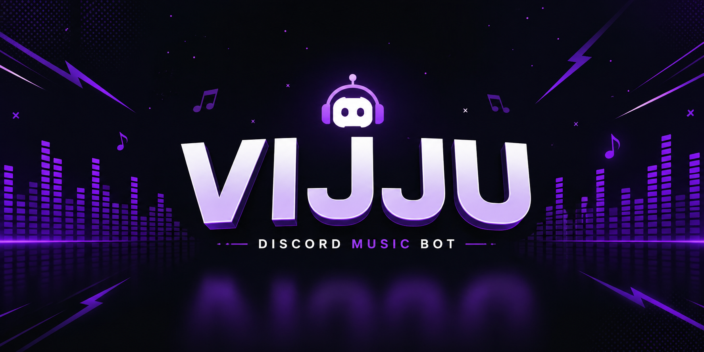

🎧 VIJJU MUSIC BOT

  

  <b>🚀 Powerful • Fast • High Quality Music Bot for Discord</b>

---

✨ Features

- 🎵 High Quality Music Playback
- ⚡ Fast & Stable (Lavalink Supported)
- 📃 Queue System
- 🔁 Loop / Repeat Modes
- 🔍 YouTube & URL Support
- 🔊 Volume Control
- ⏯️ Pause / Resume / Skip
- 🛡️ Easy Setup

---

🔗 Links

  
  
  

---

📥 Installation Guide

🧩 Step 1: Clone Repo

git clone https://github.com/yourusername/vijju-music-bot.git
cd vijju-music-bot

---

⚙️ Step 2: Install Dependencies

npm install

---

🔐 Step 3: Setup ".env"

Create a ".env" file and add:

TOKEN=your_discord_bot_token
PREFIX=!
LAVALINK_HOST=localhost
LAVALINK_PORT=2333
LAVALINK_PASSWORD=youshallnotpass

---

▶️ Step 4: Start Bot

node index.js

---

🌐 Lavalink Setup

1. Download Lavalink ".jar" file
2. Install Java (Java 11+)
3. Create "application.yml" file

Example config:

server:
  port: 2333
lavalink:
  server:
    password: "youshallnotpass"

Run Lavalink:

java -jar Lavalink.jar

---

📌 Commands

Command| Description
"!play <song>"| Play music
"!skip"| Skip song
"!stop"| Stop music
"!queue"| Show queue
"!loop"| Loop music

---

🛠️ Requirements

- Node.js v16+
- Java 11+
- Discord Bot Token

---

👑 Author

Vijju

---

⭐ Support

If you like this bot:

- ⭐ Star the repo
- 🍴 Fork it
- 📢 Share with friends

---

  💜 Made with love by Vijju

